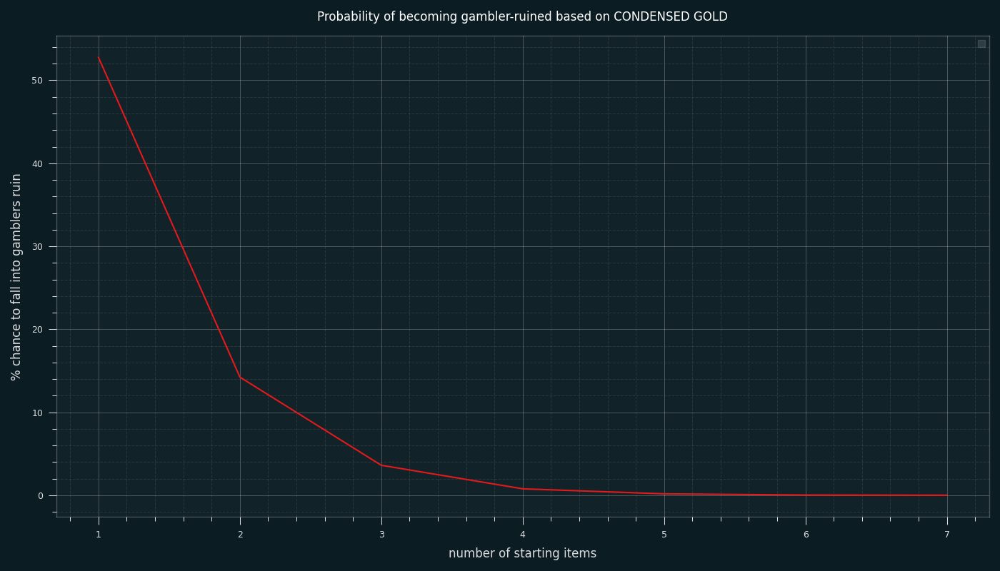
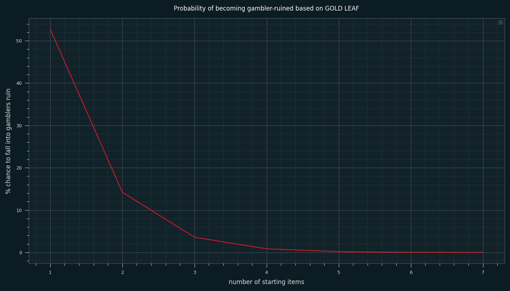
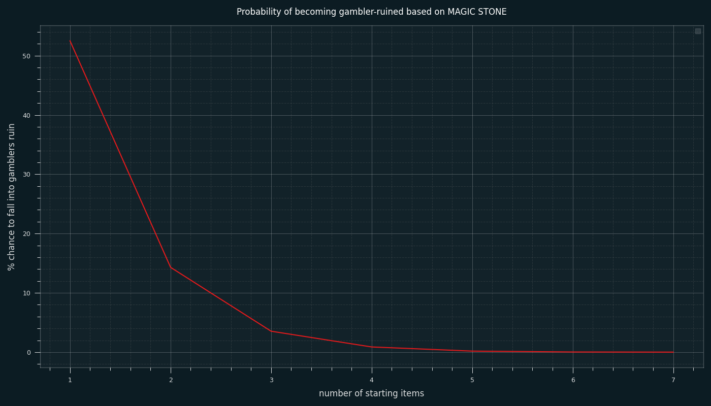
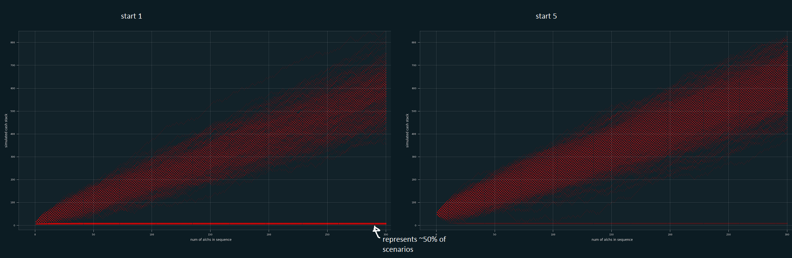

From OSRS League Raging Echoes

Golden God has a 65% chance for the item to not be consumed. This means a 35% chance to be consumed. Assuming you are alching your highest value item, what are the chances to consume your last item (e.g. become 'gambler ruined') depending on how many items you start with?

For example, starting with 2 items drops the gambler ruin to 12%. See graphs. It depends on each alch value.
Listed are 3 easy to get stones, condensed gold, gold leaf, and magic stone.

Script uses eco_5 lib for graphing

Condensed Gold:

Gold Leaf:

Magic Stone:

Monte Carlo simulation of starting with 1 vs. 5 condensed gold over number of alchs:

